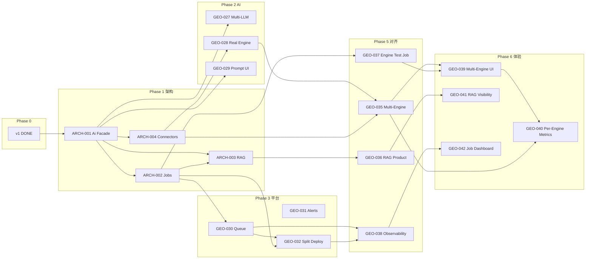

# GEO Studio 开发总计划

> **本文档是开发进度的唯一统筹入口。**  
> 读完本文即可知道：现在在哪个阶段、下一步做什么、相关文件在哪、如何更新状态。

**最后更新**：2026-06-13  
**当前阶段**：Phase 7 — 能力深度提升（执行中）

---

## 1. 文档体系（谁管什么）

| 文件 | 角色 | 何时更新 |
|------|------|----------|
| **[DEVELOPMENT-PLAN.md](./DEVELOPMENT-PLAN.md)**（本文） | 总计划、阶段划分、依赖、工作流 | 新阶段立项 / 优先级调整 |
| **[PROGRESS.md](./PROGRESS.md)** | **活文档**：当前焦点、进行中的 SPEC/Task、阻塞项 | 每个 Task 开始/完成时 |
| [ROADMAP.md](./ROADMAP.md) | v1 历史与约束摘要（只读归档倾向） | v1 里程碑变更时 |
| [ARCHITECTURE.md](./ARCHITECTURE.md) | 分层契约与技术债 | 架构规则变更时 |
| [API-ENDPOINTS.md](./API-ENDPOINTS.md) | 前后端断点对照 | API 变更后 |
| [GEO-Studio-产品文档.md](./GEO-Studio-产品文档.md) | 已交付产品说明 | 用户可见功能发布时 |
| [GEO-Studio-产品方案.md](./GEO-Studio-产品方案.md) | 战略愿景（长期） | 产品方向变更时 |
| [`cursor-kit/plan/master-plan.yaml`](../cursor-kit/plan/master-plan.yaml) | **机器可读**阶段/SPEC/依赖/状态 | 与 PROGRESS 同步 |
| [`cursor-kit/specs/`](../cursor-kit/specs/) | 可执行 SPEC（开工前 `status: ACTIVE`） | Planner 立项时 |
| [`cursor-kit/tasks/`](../cursor-kit/tasks/) | 可执行 Task（≤3 文件） | Planner 拆 task 时 |

**原则**：不再把需求散落在聊天、ROADMAP 脚注或临时 markdown 里；一切新工作先进 `master-plan.yaml` backlog，批准后再开 SPEC。

---

## 2. 阶段总览

```
Phase 0  产品 v1           ✅ DONE（2026-06-12）
Phase 1  架构治理           ✅ DONE
Phase 2  AI 与引擎能力      ✅ DONE
Phase 3  异步与可观测       ✅ DONE
Phase 4  体验与设计         ✅ DONE
Phase 5  架构对齐与平台能力  ✅ DONE（GEO-035~038）
Phase 6  产品能力补全与体验  ✅ DONE（GEO-039~042）
Phase 7  能力深度提升         🎯 规划中（不扩功能面）
```

**明确不做**（与单用户前提冲突）：多租户、RBAC、审核工作流。

---

## 3. Phase 1 — 架构治理（已完成）

> 目标：除多租户外，**严肃落实** [ARCHITECTURE.md](./ARCHITECTURE.md) 分层；消除 v1 漂移；为 Phase 2+ 打地基。

| 顺序 | SPEC | 目标 | 依赖 | 状态 |
|------|------|------|------|------|
| 1.1 | **SPEC-GEO-ARCH-001** | `ai/` Facade，消除 engine/scoring/content 直引 `llm-client` | v1 DONE | ✅ `DONE` |
| 1.2 | **SPEC-GEO-ARCH-002** | Job 抽象 + 跑批/生成/发布异步化（Worker 消费） | ARCH-001 | ✅ `DONE` |
| 1.3 | **SPEC-GEO-ARCH-004** | 引擎/发布连接器注册表 + 能力矩阵文档 | ARCH-001 | ✅ `DONE` |
| 1.4 | **SPEC-GEO-ARCH-003** | RAG + 向量 Repository（仅 `ai/` 层） | ARCH-001, ARCH-002 | ✅ `DONE` |

**Phase 1 完成标准**：

- `npm --prefix backend run check:architecture` 无 grandfather 例外（或例外清单为空）
- 诊断跑批、内容生成、发布均有 Job 记录与 Worker 路径
- 连接器新增只需注册，不改 Diagnostic/Content 核心
- PROGRESS.md 中 Phase 1 全部 SPEC 为 `DONE`

---

## 4. Phase 2 — AI 与引擎能力

| 顺序 | SPEC | 目标 | 依赖 |
|------|------|------|------|
| 2.1 | **SPEC-GEO-027** | 多 LLM 路由（OpenAI 以外提供商抽象） | ARCH-001 | ✅ `DONE` |
| 2.2 | **SPEC-GEO-028** | 真实引擎连接器 ×1（Perplexity） | ARCH-004 | ✅ `DONE` |
| 2.3 | **SPEC-GEO-029** | Prompt 版本 UI + 运行时可切换 | ARCH-001 | ✅ `DONE` |

---

## 5. Phase 3 — 异步与可观测

| 顺序 | SPEC | 目标 | 依赖 |
|------|------|------|------|
| 3.1 | **SPEC-GEO-030** | 消息队列（BullMQ + Redis）替换纯 cron | ARCH-002 | ✅ `DONE` |
| 3.2 | **SPEC-GEO-031** | 告警外推（Webhook / 邮件） | GEO-023 | ✅ `DONE` |
| 3.3 | **SPEC-GEO-032** | ai / worker 独立部署入口（同仓库多进程） | ARCH-002, GEO-030 | ✅ `DONE` |

---

## 6. Phase 4 — 体验与设计

| 顺序 | SPEC | 目标 | 依赖 | 状态 |
|------|------|------|------|------|
| 4.1 | **SPEC-GEO-033** | 设计系统 / Figma 对齐（见 designrefer.md） | — | ✅ `DONE` |
| 4.2 | **SPEC-GEO-034** | 看板响应式与移动端可读 | GEO-033 | ✅ `DONE` |

---

## 7. Phase 5 — 架构对齐与平台能力（已完成）

> 目标：对齐 [GEO-Studio-产品方案.md](./GEO-Studio-产品方案.md) 第四节架构图与 [ARCHITECTURE.md](./ARCHITECTURE.md) 目标态差距分析。

| 顺序 | SPEC | 目标 | 依赖 | 状态 |
|------|------|------|------|------|
| 5.1 | **SPEC-GEO-035** | 多引擎并行跑批（Registry 多 connector 实测落库） | GEO-028, ARCH-004 | ✅ `DONE` |
| 5.2 | **SPEC-GEO-036** | RAG 产品化：断言自动索引 + **pgvector** 检索 | ARCH-003 | ✅ `DONE` |
| 5.3 | **SPEC-GEO-037** | 引擎单题试跑 Job 化（HTTP 202） | ARCH-002 | ✅ `DONE` |
| 5.4 | **SPEC-GEO-038** | 可观测基线：Job 指标、结构化日志、部署文档 | GEO-030, GEO-032 | ✅ `DONE` |

**建议实施顺序**：035 与 036 可并行；037、038 互不阻塞，可在 035 之后穿插。

**Phase 5 完成标准**：

- 跑批可对多个 `engineId` 产出可对比的 EngineTest 记录
- Assertion CRUD 后 RAG chunk 自动同步；向量检索走 DB 索引
- 单题引擎试跑不再阻塞 HTTP 同步路径
- Job 队列状态可查询；Worker 部署文档与实现一致

---

## 8. Phase 6 — 产品能力补全与体验（已完成）

> 目标：把 Phase 5 **后端已具备**的能力暴露到看板，兑现产品方案「多引擎实测 / RAG 可信 / 运维可见」的用户价值。  
> **不做**：多租户、RBAC、独立 API 网关、Prometheus 全栈（留 Phase 7+）。

| 顺序 | SPEC | 目标 | 依赖 | 状态 |
|------|------|------|------|------|
| 6.1 | **SPEC-GEO-039** | 多引擎 UI：跑批选 engineIds、明细展示 engineId、单题可选引擎 | GEO-035, GEO-037 | ✅ `DONE` |
| 6.2 | **SPEC-GEO-040** | 按 engineId 聚合指标与趋势（多引擎横向对比最小版） | GEO-035, GEO-039 | ✅ `DONE` |
| 6.3 | **SPEC-GEO-041** | RAG 引用可见性（生成/评分展示知识片段） | GEO-036 | ✅ `DONE` |
| 6.4 | **SPEC-GEO-042** | Job/队列运维看板（`GET /jobs/stats` 前端化） | GEO-038 | ✅ `DONE` |

**建议实施顺序**：039 → 040；041、042 可与 039 并行（041 仅依赖 036，042 仅依赖 038）。

**Phase 6 完成标准**：

- 用户可在看板选择多个引擎跑批，并在明细中看到每条实测的 `engineId`
- 趋势/指标可按引擎筛选或对比（至少 mention_rate）
- 内容生成或试跑结果可查看 RAG 引用的品牌事实片段（有则显示）
- 看板可查看 Job 队列 pending/running/completed/failed 与 queueMode

**Phase 6 明确不做**（除非改单用户前提）：对象存储、监测爬虫、专用时序库、连接器大规模扩展（另开 Phase 7 backlog）。

---

## 8.1 Phase 7 — 能力深度提升（不加新功能）

> 目标：保持现有功能面不扩张，提升每个模块的可信度、可解释性和闭环效率。

### 核心原则

- 不新增导航模块，不扩 API 面，优先强化现有链路（诊断 → 评分 → 生成 → 分发 → 告警）
- 每个改动都要提升“决策可用性”，而不是只提升“功能可见性”
- 验收以真实引擎/真实数据下的稳定表现为准，避免演示模式误判

### 能力深度优先级（按顺序）

1. **诊断可信度**：明确区分可决策结果与演示结果（引擎可用性、失败率、来源质量）
2. **评分解释力**：围绕断言覆盖、准确性偏差给出可执行解释，不只给分数
3. **内容验证闭环**：初稿生成后必须能快速验证“是否更易被引用”
4. **分发效果对照**：分发动作与后续跑批结果形成前后对比
5. **运维可行动化**：Job 失败信息可直接指导下一步处理

### Phase 7 统一验收标准

- 同品牌同题集两次跑批结果波动可解释（非随机漂移）
- 跑批结果可标识 `business-ready / partial / demo`
- 低分项能生成可执行改写建议（不仅是告警）
- 初稿生成后可看到验证反馈（提及/准确性方向）
- 分发动作可在后续趋势中观察到方向性变化

---

## 9. 标准开发工作流

```text
① 查 PROGRESS.md → 确认当前 Phase 与进行中的 SPEC
② 若 backlog 项未立项 → 用户批准 → SPEC status: PLANNED → ACTIVE
③ Planner 读 SPEC + ARCHITECTURE.md → 拆 ≤3 张 task 卡
④ 用户批准 task → Implementer 执行（R1–R9）
⑤ 验证：test + typecheck + check:architecture + checklist + golden
⑥ 更新 PROGRESS.md + master-plan.yaml 中 status
⑦ 该 SPEC 全部 task DONE → SPEC status: DONE → 进入下一 SPEC
```

### 角色分工

| 角色 | 动作 |
|------|------|
| **你（产品负责人）** | 批准 Phase 内 SPEC 开工；调整 `master-plan.yaml` 优先级 |
| **Planner** | SPEC → Task；更新 `affected_files` 与层归属 |
| **Implementer** | 只改 task 白名单；遵守 ARCHITECTURE |
| **Reviewer** | 对照 SPEC + ARCHITECTURE + PROGRESS 打 BLOCKER |

### 开工前检查清单

- [ ] SPEC 在 `master-plan.yaml` 中且 `approved: true`
- [ ] SPEC `status: ACTIVE`
- [ ] 已读 [ARCHITECTURE.md](./ARCHITECTURE.md) 并标明所属层
- [ ] Task 已写入 `cursor-kit/tasks/`，`files_to_touch` ≤3
- [ ] PROGRESS.md 已标记「进行中」

---

## 10. v1 交付物（Phase 0，已完成）

详见 [ROADMAP.md](./ROADMAP.md) 与 [GEO-Studio-产品文档.md](./GEO-Studio-产品文档.md)。

- SPEC GEO-001 ~ 025 + PROD-001 + 026 全部 `DONE`
- 用户旅程闭环可在看板操作
- 工程质量：backend test/typecheck + web build

**v1 之后不得再「无 SPEC 加功能」。**

---

## 11. 依赖关系图



---

## 12. 相关命令

```bash
# 日常验证（每个 task 完成后）
npm --prefix backend test
npm --prefix backend run typecheck
npm --prefix backend run check:architecture
npm --prefix web run build

# 可选：task 边界检查
python cursor-kit/scripts/validate_task.py --task cursor-kit/tasks/TASK-XXX.yaml
```

---

## 13. 变更记录

| 日期 | 变更 |
|------|------|
| 2026-06-13 | **启动 Phase 7 方向约束**：不扩功能面，转向“能力深度提升”；新增统一验收标准 |
| 2026-06-13 | **Phase 6 立项**：GEO-039~042（多引擎 UI、按引擎趋势、RAG 可见性、Job 看板）；用户批准规划方向 |
| 2026-06-13 | Phase 5 完成（GEO-035~038） |
| 2026-06-13 | 立项 Phase 5（GEO-035~038）；更新 master-plan 与架构差距 backlog |
| 2026-06-12 | 创建总计划；v1 标记 DONE；启动 Phase 1（ARCH-001~004）与 Phase 2~4 backlog SPEC 编号 |
